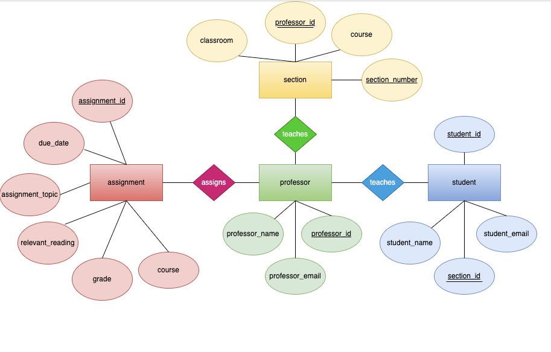

# Data Normalization and Entity-Relationship Diagramming

# Original Data Set:
| assignment_id | student_id | due_date | professor | assignment_topic                | classroom | grade | relevant_reading    | professor_email   |
| :------------ | :--------- | :------- | :-------- | :------------------------------ | :-------- | :---- | :------------------ | :---------------- |
| 1             | 1          | 23.02.21 | Melvin    | Data normalization              | WWH 101   | 80    | Deumlich Chapter 3  | l.melvin@foo.edu  |
| 2             | 7          | 18.11.21 | Logston   | Single table queries            | 60FA 314  | 25    | Dümmlers Chapter 11 | e.logston@foo.edu |
| 1             | 4          | 23.02.21 | Melvin    | Data normalization              | WWH 101   | 75    | Deumlich Chapter 3  | l.melvin@foo.edu  |
| 5             | 2          | 05.05.21 | Logston   | Python and pandas               | 60FA 314  | 92    | Dümmlers Chapter 14 | e.logston@foo.edu |
| 4             | 2          | 04.07.21 | Nevarez   | Spreadsheet aggregate functions | WWH 201   | 65    | Zehnder Page 87     | i.nevarez@foo.edu |
| ...           | ...        | ...      | ...       | ...                             | ...       | ...   | ...                 | ...               |
## How is this dataset not compliant with 4NF?  
**assignment_id** and student_id together seem to comprise a composite primary key, where the following non-key attributes describe only parts of it. This is a clear violation of the **second normal form**. These are two attributes of two different entities that must be separated into two different tables. Furthermore, several non-key fields provide facts about other non-key fields, which is a violation of the **third normal form**. For instance, professor_email provides information about the professor, which is not a key field. Although there appears to be no splitting of multi-valued facts across multiple fields/lines, this table is still not **fourth normal form** compliant because it does not comply with any of the previous two.   

There are non-unique values in the primary key column(s); there should be a surrogate key for each of the (possibly) two or more entities in this table (professor,student,assignment), which will be discussed further in this report.

## Solution
| assignment_id | due_date | assignment_topic       | relevant_reading   | course             |
| :------------ | :------- | :--------------------- | :----------------- | :----------------- |
| 1             | 23.02.21 | Data normalization     | Duemlich Chapter 3 | Database Design    |
| 2             | 18.11.21 | Single Table Queries   | Dümmlers Chapter 11| Database Design    |      

Every non-key field following the primary key field, **assignment_id**–which represents each assignment–provides a fact about the assignment itself, thus satisfying both the second and third normal-forms. Furthermore, this table assumes that each assignment corresponds to one course (not to be confused by sections, which are renditions of the same course). This table was built around the logic that each course, regardless of how many sections/renditions it may have, has a unique syllabus that enumerates all assignments. Each syllabus is unique to the course. For further clarification, Data Visualization and Database Design are regarded as two separate courses each with unique, separate assignments (even if the assignments are similar in nature). Considering that every student receives a grade upon completion of the assignment, introducing a ‘grade’ field necessitating a value for each student–an entity of its own–would violate the fourth normal form. With presumably numerous values corresponding to each assignment, a grade field would inevitably be a multivalued fact that belongs elsewhere. The solution requires treating ‘grades’ as its own entity represented by its own table;
### Grade_for_assignment  
| grade_id | grade | assignment_id | student_id  |
| :------- | :-----| :------------ | :---------- |
| 1        | 80    | 1             | 1           |
| 2        | 25    | 2             | 7           |
| 3        | 75    | 1             | 2           |
| 4        | 92    | 5             | 2           |
| 5        | 65    | 4             | 2           |  
Each grade deserves its own record that describes both the assignment to which it corresponds, and the student whose performance it reflects. This table is fourth normal-form compliant because all non-key fields provide facts about the primary key, **grade_id**, which uniquely identifies each individual grade.  
### Professor table  
| professor_id | professor_ name| email             |
| :----------- | :------------- | :---------------- |
| 1            | Melvin         | l.melvin@foo.edu  |
| 2            | Logston        | e.logston@foo.edu |
| 3            | Nevarez        | i.nevarez@foo.edu |    
### Student table  
| student_id | student_name  | section_id |
| :--------- | :------------ | :--------- |
| 1          | Svjetljana    | 1          |
| 2          | Theodosius    | 2          |
| 3          | Dàhuánggou    | 2          |  
### Section_to_course
| section_id | section | course                            | professor_id | classroom  |
| :--------- | :------ | :-------------------------------- | :----------- | :--------- |
| 1          | 001     | Database design                   | 1            | WWH 101    |
| 2          | 002     | Database design                   | 2            | 60FA 314   | 
| 3          | 001     | Applied Internet Technologies     | 1            | WWH 101    |
| 4          | 001     | Discard Studies                   | 3            | WWH 101    | 
| 5          | 002     | Discard Studies                   | 3            | 60FA 314   |  
More than one professor may teach a particular course, which may be divided into several sections that meet in different classrooms. The ‘section’ table uniquely identifies each particular section, which meets in one classroom under one professor. Using a ‘course’ or ‘professor’ as the primary key would violate both the first normal-form and potentially the fourth, because such a table would inevitably have non-singular values. 
The ‘student’ table provides the name of each student along with the section they’re enrolled in. Finding all the students in a particular section would simply require searching all students whose **section_id** value holds a particular value. For instance, all students whose **section_id** is 2 are in section 002 of Database Design, taught by professor (professor_id **2** =)  Logston.   

### [ER Diagram](images/assign#5.svg)
